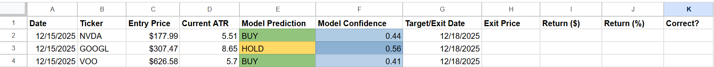

# Advanced Stock Trend Classifier (V2)


## Project Overview
This project is an advanced Machine Learning pipeline designed to predict short-term market direction. Unlike basic models that rely on raw prices, this V2 iteration focuses on **Statistical Stationarity**, **Dynamic Volatility Targeting**, and **Regime-Adaptive Validation**.

The project concludes with a **30-Day Paper Trading experiment**, where model predictions were validated in a live environment using an Excel ledger to audit performance against real-time market data.

## Key Data Science Concepts

### 1. Solving Non-Stationarity (Feature Engineering)
One of the biggest pitfalls in Financial ML is training on raw prices (e.g., AAPL at $50 vs $200). Models fail to generalize because the raw numbers change over time.
*   **Solution:** All features in this model are transformed into **Stationary Ratios, Oscillators, or Distances**.
*   *Example:* Instead of using `SMA_50 = 150.00`, I used `Dist_SMA_50 = 0.05` (Price is 5% above the average). This allows the model to detect patterns regardless of the absolute stock price.

### 2. Dynamic Volatility Targeting (Labeling)
Fixed thresholds (e.g., "Buy if price goes up 2%") fail because market volatility changes.
*   **Solution:** Targets are generated dynamically using **ATR (Average True Range)**.
*   **Logic:** `Signal = 1` only if `Future_Return > 1.0 * ATR`.
*   This ensures the model only attempts to predict moves that are statistically significant relative to the current market "temperature."

### 3. Walk-Forward Validation
Standard `train_test_split` is dangerous in time-series data due to lookahead bias and regime changes (e.g., training in a Bull market and testing in a Bear market).
*   **Solution:** Implemented **TimeSeriesSplit (5 Folds)**.
*   The model is iteratively trained on a growing window of past data and tested on the immediate future, simulating real-world trading conditions.

## Feature Architecture

The model utilizes 11 engineered features across four categories:

| Category | Indicators | Financial Logic |
| :--- | :--- | :--- |
| **Volatility** | `ADX`, `ATR_Perc` | **(Most Predictive)** `ADX` determines if the market is trending or ranging. |
| **Trend** | `Norm_MACD`, `Dist_SMA_50` | `MACD` normalized by price to capture momentum shifts relative to cost basis. |
| **Price Action** | `Dist_High_20`, `Dist_Low_20` | Quantifies proximity to Donchian Channel breakouts. |
| **Momentum** | `RSI`, `OBV_Slope` | Identifies overbought conditions and volume divergence. |

## Model Performance

The model was evaluated using Walk-Forward Validation to ensure robustness.

### Feature Importance Analysis
The Random Forest analysis yields a fascinating insight: **ADX (Trend Strength)** is by far the most dominant feature, followed by Volatility (`ATR_Perc`).

This suggests the model has learned a **"Regime Detection" strategy**. Instead of simply looking at price momentum (like RSI, which ranked low), the model prioritizes *whether a trend exists* (ADX) and the *magnitude of volatility* (ATR) before making a directional prediction.


### Classification Analysis (Confusion Matrix)
The confusion matrix highlights a distinct behavior in the model's decision-making:

1.  **Aggressive "Buy" Bias:** The model predicts "Buy" most frequently (right-most column).
2.  **High Recall (Sensitivity):** It successfully captured 42% of the actual Buy opportunities (True Positives = 49), which is decent for noisy financial data.
3.  **Low Precision:** However, this aggressiveness leads to false positives. The model often mistakes "Hold" periods for "Buy" signals.

*Interpretation: The model effectively identifies the onset of volatility but struggles to differentiate between a true breakout and a false start during choppy markets.*


## Forward-Testing & Validation (Paper Trading)

While historical backtesting provides a theoretical baseline, it often suffers from overfitting. To rigorously test the model's viability, I conducted a **30-day Out-of-Sample Paper Trading** phase.

### Methodology
1.  **Execution:** The `predict_live()` function was run daily before market open.
2.  **Logging:** Signals (Buy/Sell/Hold) and Confidence Scores were recorded in an Excel Ledger.
3.  **Audit:** Entry and Exit prices were logged manually to ensure no "peeking" or data leakage occurred during the process.

### Results Ledger
*The spreadsheet below tracks the Win Rate, Profit/Loss (PnL), and prediction confidence for the validation period.*



## Installation & Usage

1.  **Clone the repo:**
    ```bash
    git clone https://github.com/aidankaras/stock-classifier-v2.git
    ```
2.  **Install dependencies:**
    ```bash
    pip install -r requirements.txt
    ```
3.  **Run the analysis:**
    Open `stock_classifier.ipynb` in Jupyter Lab or VS Code.
4.  **Live Prediction:**
    Execute the final cell to fetch live data from Yahoo Finance and generate a prediction for today:
    ```python
    predict_live("AAPL", model)
    ```

## Disclaimer
This project is for **educational and portfolio purposes only**. It applies Data Science concepts to financial data but is not financial advice. Algorithmic trading involves significant risk.