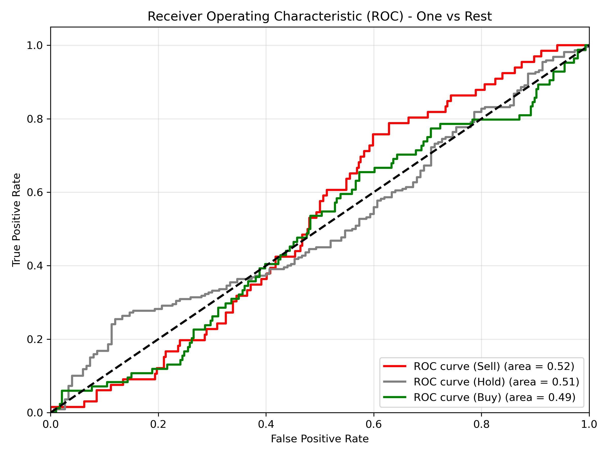

# Advanced Stock Trend Classifier (V2)


## Project Overview
This project is an advanced Machine Learning pipeline designed to predict short-term market direction. Unlike basic models that rely on raw prices, this V2 iteration focuses on **Statistical Stationarity**, **Dynamic Volatility Targeting**, and **Regime-Adaptive Validation**.

The project concludes with a **30-Day Paper Trading experiment**, where model predictions were validated in a live environment using an Excel ledger to audit performance against real-time market data.

## Key Data Science Concepts

### 1. Solving Non-Stationarity (Feature Engineering)
One of the biggest pitfalls in Financial ML is training on raw prices (e.g., AAPL at $50 vs $200). Models fail to generalize because the raw numbers change over time.
*   **Solution:** All features in this model are transformed into **Stationary Ratios, Oscillators, or Distances**.
*   *Example:* Instead of using `SMA_50 = 150.00`, I used `Dist_SMA_50 = 0.05` (Price is 5% above the average). This allows the model to detect patterns regardless of the absolute stock price.

### 2. Dynamic Volatility Targeting (Labeling)
Fixed thresholds (e.g., "Buy if price goes up 2%") fail because market volatility changes.
*   **Solution:** Targets are generated dynamically using **ATR (Average True Range)**.
*   **Logic:** `Signal = 1` only if `Future_Return > 1.0 * ATR`.
*   This ensures the model only attempts to predict moves that are statistically significant relative to the current market "temperature."

### 3. Walk-Forward Validation
Standard `train_test_split` is dangerous in time-series data due to lookahead bias and regime changes (e.g., training in a Bull market and testing in a Bear market).
*   **Solution:** Implemented **TimeSeriesSplit (5 Folds)**.
*   The model is iteratively trained on a growing window of past data and tested on the immediate future, simulating real-world trading conditions.

## Feature Architecture

The model utilizes 11 engineered features across four categories:

| Category | Indicators | Financial Logic |
| :--- | :--- | :--- |
| **Volatility** | `ADX`, `ATR_Perc` | **(Most Predictive)** `ADX` determines if the market is trending or ranging. |
| **Trend** | `Norm_MACD`, `Dist_SMA_50` | `MACD` normalized by price to capture momentum shifts relative to cost basis. |
| **Price Action** | `Dist_High_20`, `Dist_Low_20` | Quantifies proximity to Donchian Channel breakouts. |
| **Momentum** | `RSI`, `OBV_Slope` | Identifies overbought conditions and volume divergence. |

## Model Performance & Evaluation

The model was evaluated on a held-out test set (the most recent 15% of data). The results highlight the significant challenge of applying non-linear models to stochastic financial data, particularly when market regimes shift between training and testing periods.

### Feature Importance Analysis
The Random Forest prioritized **Market Structure** over Momentum.
*   **Top Predictors:** `ADX` (Trend Strength) and `ATR_Perc` (Volatility) were the most influential features.
*   **Low Importance:** `RSI` and `Body_Perc` (Candlestick shape) had minimal impact.
*   **Interpretation:** The model attempts to classify "Regimes" (Volatile vs. Calm) rather than predicting directional price momentum.


### Performance Metrics (The "Regime Shift" Problem)
While Walk-Forward Validation during training showed promising stability (~46% accuracy), the model struggled to generalize to the final test set.

| Metric | Score | Analysis |
| :--- | :--- | :--- |
| **Accuracy** | 37% | Only slightly above random chance (33%) for a 3-class problem. |
| **Balanced Accuracy** | 29% | The model struggles to correctly identify minority classes (Buy/Sell). |
| **Log Loss** | 1.07 | High uncertainty in predictions. |
| **MCC** | **-0.06** | **Critical Finding:** The negative Matthews Correlation Coefficient indicates a slight inverse correlation. The model learned patterns from the training period that did not persist in the test period (Concept Drift), leading to predictions that were systematically "out of sync" with recent price action.

### Classification Bias (Confusion Matrix)
The matrix reveals a heavy bias toward the **"Hold" (0)** class.
*   **Precision (Hold):** 0.56 (The model is safest when predicting no movement).
*   **Recall (Buy/Sell):** Very low (~0.20). The model fails to "pull the trigger" on trends, often categorizing legitimate moves as noise.


### ROC-AUC Analysis
The Receiver Operating Characteristic (ROC) curves confirm the findings of the MCC metric.

*   **Observation:** The curves for all three classes (Buy, Sell, Hold) hug the diagonal line (AUC $\approx$ 0.50).
*   **Interpretation:** An AUC of 0.50 indicates "Random Guessing." This confirms that while the feature engineering (ADX, ATR) worked mathematically, the *signal* found in the training years dissolved in the test year. This is a classic example of **Market Efficiency** absorbing simple technical alphas over time.



## Forward-Testing & Validation (Paper Trading)

While historical backtesting provides a theoretical baseline, it often suffers from overfitting. To rigorously test the model's viability, I conducted a **30-day Out-of-Sample Paper Trading** phase.

### Methodology
1.  **Execution:** The `predict_live()` function was run daily before market open.
2.  **Logging:** Signals (Buy/Sell/Hold) and Confidence Scores were recorded in an Excel Ledger.
3.  **Audit:** Entry and Exit prices were logged manually to ensure no "peeking" or data leakage occurred during the process.

### Results Ledger
*The spreadsheet below tracks the Win Rate, Profit/Loss (PnL), and prediction confidence for the validation period.*


## Disclaimer
This project is for **educational and portfolio purposes only**. It applies Data Science concepts to financial data but is not financial advice. Algorithmic trading involves significant risk.
```