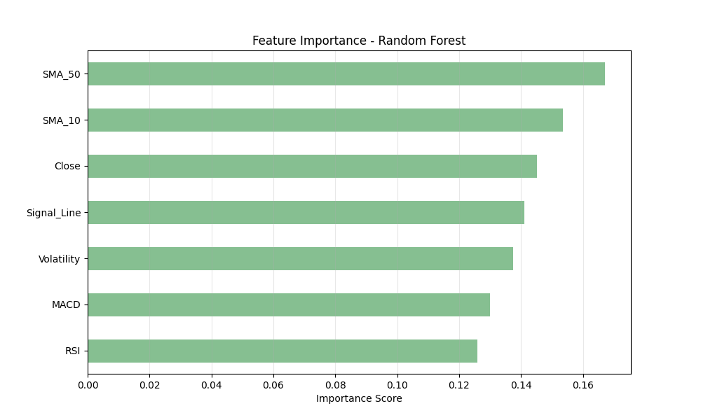
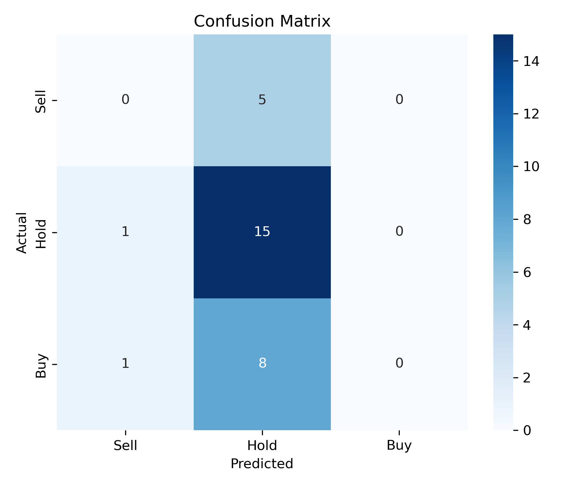

# Algorithmic Trading with Random Forest


## Project Overview
This project is a Machine Learning pipeline designed to predict short-term stock price movements (5-day horizon) for S&P 500 equities. Unlike traditional technical analysis, this approach utilizes a **Random Forest Classifier** to identify non-linear relationships between momentum indicators and future price action.

I'm validating this model through a **Walk-Forward Paper Trading** simulation to ensure robustness against market volatility before deployment.

## Technical Architecture

### 1. ETL Pipeline (Extract, Transform, Load)
*   **Data Source:** `yfinance` API (Yahoo Finance).
*   **Preprocessing:** 
    *   Automated cleaning of zero-volume trading days.
    *   Correction of Multi-Index header issues common in financial datasets.
    *   **Data Leakage Prevention:** The dataset is split using a temporal approach (`shuffle=False`), ensuring the model is strictly trained on past data to predict future data.

### 2. Feature Engineering
The model utilizes technical indicators as features to capture market psychology and momentum:
*   **RSI (Relative Strength Index):** Measures overbought/oversold conditions.
*   **MACD (Moving Average Convergence Divergence):** Identifies trend reversals.
*   **Bollinger Volatility:** Standard deviation of returns to measure market fear.
*   **SMA/EMA:** Trend confirmation using 10, 12, 26, and 50-day windows.

### 3. Machine Learning Model
*   **Algorithm:** Random Forest Classifier.
*   **Class Imbalance Strategy:** Applied `class_weight='balanced'` to penalize the model for ignoring minority classes (Buy/Sell signals), as financial data is heavily biased toward "Hold" (noise).
*   **Target Definition:** A signal is generated only if the 5-day future return exceeds a **2% threshold**, filtering out low-profit trades.

## Model Performance
The model was evaluated on unseen test data (the most recent 20% of the timeline).

### Feature Importance
The analysis reveals that **Volatility** and **RSI** are the dominant predictors, suggesting the algorithm is primarily capitalizing on mean-reversion strategies during high-volatility periods.



### Confusion Matrix
The heatmap below visualizes the model's classification accuracy. Note the focus on **Precision** for the "Buy" class (1) to minimize false positives (bad trades).



## Paper Trading & Validation Strategy
To validate the model in a live environment without financial risk, I am conducting a forward-test.

**Methodology:**
1.  **Daily Execution:** The `predict_live()` function is run every morning before market open.
2.  **Trade Logging:** Signals are logged in a tracking ledger with Entry Price and Target Date.
3.  **Exit Strategy:** Positions are closed exactly 5 days later to match the training horizon.
4.  **Metric:** Win Rate is calculated as `(Profitable Trades / Total Trades)`.

## Usage

1. **Install Dependencies:**
   ```bash
   pip install -r requirements.txt


1.  **Run the Notebook:** Execute stock_classifier.ipynb to retrain the model.
2.  **Get Live Prediction:** Run the final cell to get today's signal - predict_live("TICKER", model)
3.  **Disclaimer:** This project is for educational and research purposes only. It does not constitute financial advice.